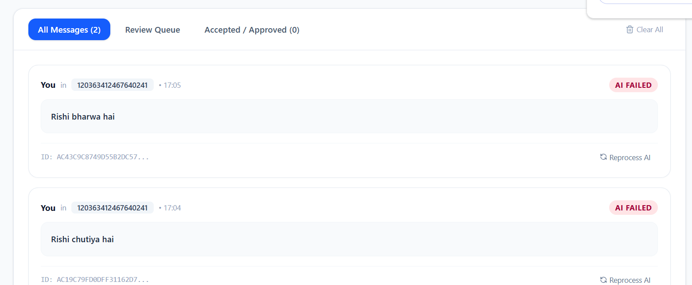
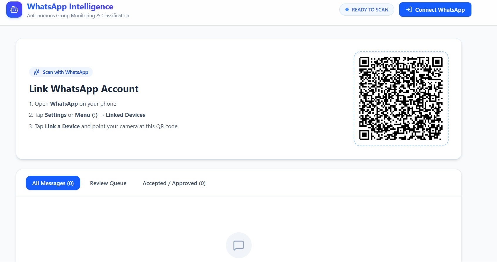
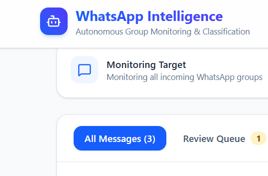
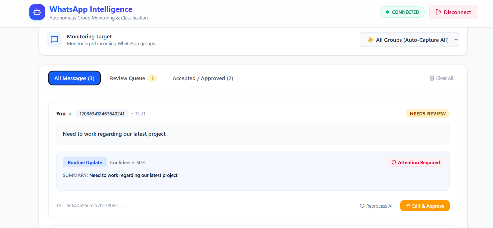
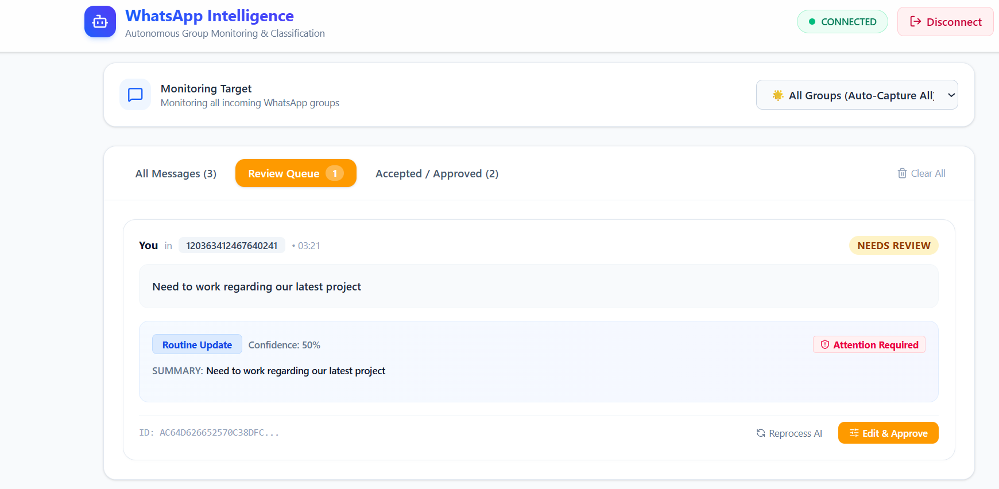

# WhatsApp Message Intelligence

A production-ready WhatsApp integration system that monitors a specific WhatsApp group, safely deduplicates messages, and uses Google Gemini to automatically classify, summarize, and extract structured data (including analyzing images!) for human review.

## Screenshots

## Setup Instructions

1. **Database:**
   Ensure PostgreSQL is running. Run the migrations in `database/migrations/01_initial_schema.sql` to set up the two required tables.

2. **Environment Variables:**
   Create `.env` files in `backend/` and `wa-connector/`:
   - `GEMINI_API_KEY`: Your Gemini API Key
   - `SUPABASE_URL` / `SUPABASE_KEY`: Database connection details

3. **Install Dependencies:**
   - In `backend/`: `npm install`
   - In `wa-connector/`: `npm install`
   - In `frontend/`: `npm install`

4. **Run the Application:**
   Start all three services simultaneously (e.g. `npm run dev` in all 3 folders).

5. **Demo Execution:**
   - Visit `http://localhost:5173`
   - Scan the QR code to authenticate WhatsApp.
   - Send a message in a group, then select that group from the dropdown.
   - View AI classifications flowing in!

See the `docs/` folder for comprehensive documentation on Architecture, Integration, AI Approach, and Limitations.
