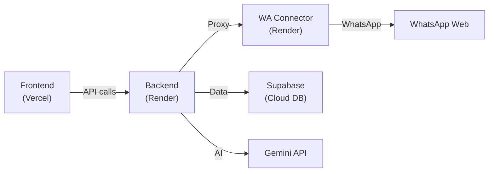

# 🚀 Deployment Guide — WhatsApp Message Intelligence

This project has **3 deployable services**. Here's how to deploy each one.

| Service | What it does | Deploy to |
|---------|-------------|-----------|
| **Frontend** (React + Vite) | Dashboard UI | **Vercel** (free, best for static/SPA) |
| **Backend** (Express API) | REST API + AI processing | **Render** (free tier Web Service) |
| **WA Connector** (whatsapp-web.js) | WhatsApp bridge | **Render** (free tier Web Service) |

> [!IMPORTANT]
> Your database is already on **Supabase** (cloud-hosted), so no database deployment is needed.

---

## Step 1: Push Code to GitHub

```bash
# From the project root
git init
git add .
git commit -m "Initial commit"
git remote add origin https://github.com/YOUR_USERNAME/whatsapp-message-intelligence.git
git push -u origin main
```

> [!WARNING]
> Add a `.gitignore` at the project root to exclude `node_modules/`, `.env`, and `.wwebjs_auth/` before pushing.

---

## Step 2: Deploy Backend to Render

### 2.1 — Create a Render Web Service

1. Go to [render.com](https://render.com) → **Dashboard** → **New +** → **Web Service**
2. Connect your GitHub repo
3. Configure:

| Setting | Value |
|---------|-------|
| **Name** | `wa-intelligence-backend` |
| **Root Directory** | `backend` |
| **Runtime** | `Node` |
| **Build Command** | `npm install` |
| **Start Command** | `npm start` |
| **Plan** | Free |

### 2.2 — Set Environment Variables

In Render's **Environment** tab, add these:

| Key | Value |
|-----|-------|
| `PORT` | `3001` (Render auto-assigns, but set as fallback) |
| `SUPABASE_URL` | `https://shbvifobhslbsmdorhct.supabase.co` |
| `SUPABASE_KEY` | *(your Supabase anon key)* |
| `GEMINI_API_KEY` | *(your Gemini API key)* |
| `WA_CONNECTOR_URL` | *(the Render URL of your WA Connector service — set after Step 3)* |

### 2.3 — Click **Create Web Service**

Render will build and deploy. Your backend URL will be something like:
```
https://wa-intelligence-backend.onrender.com
```

---

## Step 3: Deploy WA Connector to Render

### 3.1 — Create Another Render Web Service

1. **New +** → **Web Service** → same GitHub repo
2. Configure:

| Setting | Value |
|---------|-------|
| **Name** | `wa-intelligence-connector` |
| **Root Directory** | `wa-connector` |
| **Runtime** | `Node` |
| **Build Command** | `npm install` |
| **Start Command** | `npm start` |
| **Plan** | Free |

### 3.2 — Set Environment Variables

| Key | Value |
|-----|-------|
| `PORT` | `3002` |
| `BACKEND_URL` | `https://wa-intelligence-backend.onrender.com` *(from Step 2)* |

### 3.3 — Update Backend's WA_CONNECTOR_URL

Go back to your **Backend** service on Render → **Environment** tab → set:

```
WA_CONNECTOR_URL=https://wa-intelligence-connector.onrender.com
```

> [!CAUTION]
> **whatsapp-web.js** uses Puppeteer/Chromium internally. On Render's free tier, this may hit memory limits. If it fails:
> - Use Render's **Starter plan** ($7/mo) for more RAM
> - Or add a `Dockerfile` with Chromium pre-installed (see below)

### Optional: Dockerfile for WA Connector (if Chromium issues)

Create `wa-connector/Dockerfile`:
```dockerfile
FROM node:20-slim

RUN apt-get update && apt-get install -y \
    chromium \
    --no-install-recommends && \
    rm -rf /var/lib/apt/lists/*

ENV PUPPETEER_EXECUTABLE_PATH=/usr/bin/chromium

WORKDIR /app
COPY package*.json ./
RUN npm install
COPY . .

EXPOSE 3002
CMD ["node", "index.js"]
```

Then in Render, set **Environment** to **Docker** instead of Node.

---

## Step 4: Deploy Frontend to Vercel

### 4.1 — Go to Vercel

1. Visit [vercel.com](https://vercel.com) → **Add New Project**
2. Import your GitHub repository

### 4.2 — Configure Build Settings

| Setting | Value |
|---------|-------|
| **Framework Preset** | Vite |
| **Root Directory** | `frontend` |
| **Build Command** | `npm run build` |
| **Output Directory** | `dist` |

### 4.3 — Set Environment Variable

| Key | Value |
|-----|-------|
| `VITE_API_BASE` | `https://wa-intelligence-backend.onrender.com/api` |

### 4.4 — Update Frontend Code

> [!IMPORTANT]
> Before deploying, update the API base URL in [App.jsx](file:///f:/WhatsApp%20Message%20Intelligence/frontend/src/App.jsx#L22) to use the environment variable:

```diff
- const API_BASE = 'http://localhost:3001/api';
+ const API_BASE = import.meta.env.VITE_API_BASE || 'http://localhost:3001/api';
```

Also update the media URL on [line 433](file:///f:/WhatsApp%20Message%20Intelligence/frontend/src/App.jsx#L433):
```diff
- src={`http://localhost:3001/${msg.media_path.replace(/\\/g, '/')}`}
+ src={`${import.meta.env.VITE_API_BASE?.replace('/api', '') || 'http://localhost:3001'}/${msg.media_path.replace(/\\/g, '/')}`}
```

### 4.5 — Click **Deploy**

Your frontend will be live at something like:
```
https://whatsapp-message-intelligence.vercel.app
```

---

## Step 5: Update CORS (Backend)

After deployment, update [server.js](file:///f:/WhatsApp%20Message%20Intelligence/backend/server.js#L15) to restrict CORS to your Vercel domain:

```diff
- app.use(cors());
+ app.use(cors({
+   origin: [
+     'http://localhost:5173',
+     'https://whatsapp-message-intelligence.vercel.app'
+   ]
+ }));
```

---

## Summary — Deployment Checklist



- [ ] Push code to GitHub
- [ ] Deploy **Backend** to Render (with env vars)
- [ ] Deploy **WA Connector** to Render (with Dockerfile if needed)
- [ ] Cross-link the two Render service URLs in their environment variables
- [ ] Update `API_BASE` in frontend to use `import.meta.env.VITE_API_BASE`
- [ ] Deploy **Frontend** to Vercel (with `VITE_API_BASE` env var)
- [ ] Update CORS in backend to allow Vercel domain
- [ ] Redeploy backend after CORS change

> [!TIP]
> **Render free tier** spins down after 15 min of inactivity. For always-on WhatsApp monitoring, use Render's **Starter plan** ($7/mo) or set up an external ping service like [UptimeRobot](https://uptimerobot.com) to keep it alive.
